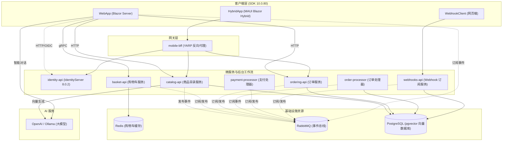

# eShop 参考应用程序 - 代码库与架构分析报告

本报告针对 **eShop 参考应用程序**（基于 **.NET Aspire** 编排的微服务电商平台）进行了全面的代码库与系统架构分析。系统已全量升级并适配 **.NET 10.0** 及最新的云原生依赖，移除了过时的冗余包，规整了底层警告。

---

## 1. 系统架构概述

该应用采用分布式微服务架构，服务之间通过 HTTP API、gRPC 以及 RabbitMQ 消息队列进行通信。整个系统的生命周期编排、服务发现及环境变量配置均由 **.NET Aspire 13.4.6** 统一管理。

---

## 2. 项目目录与结构映射

以下是 `src` 目录下各核心项目的职责、数据库类型及通信协议明细：

| 项目名称 | 目录路径 | 职责角色 | 数据存储 | 通信协议 |
| :--- | :--- | :--- | :--- | :--- |
| **eShop.AppHost** | [eShop.AppHost](file:///D:/Repos/eShop/src/eShop.AppHost) | 负责编排所有资源、容器与服务的启动。 | 无 | N/A (编排器 SDK 13.4.6) |
| **eShop.ServiceDefaults** | [eShop.ServiceDefaults](file:///D:/Repos/eShop/src/eShop.ServiceDefaults) | 配置标准 OpenTelemetry、日志、指标及健康检查。 | 无 | N/A (通用共享配置) |
| **WebApp** | [WebApp](file:///D:/Repos/eShop/src/WebApp) | 基于 Blazor Server 构建的核心电商前端网站。 | 无 | gRPC, HTTP, RabbitMQ |
| **HybridApp** | [HybridApp](file:///D:/Repos/eShop/src/HybridApp) | 基于 Blazor Hybrid (.NET MAUI) 的跨平台客户端。 | SQLite | HTTP, YARP 网关 |
| **Basket.API** | [Basket.API](file:///D:/Repos/eShop/src/Basket.API) | 处理购物车数据的存储与变更操作。 | Redis | gRPC (服务端), RabbitMQ |
| **Catalog.API** | [Catalog.API](file:///D:/Repos/eShop/src/Catalog.API) | 商品目录管理、搜索及 AI 语义向量检索。 | PostgreSQL (`catalogdb`) | HTTP (Scalar 2.16.7), RabbitMQ |
| **Identity.API** | [Identity.API](file:///D:/Repos/eShop/src/Identity.API) | 统一身份认证中心，管理用户登录与授权。 | PostgreSQL (`identitydb`) | OIDC (Duende IdentityServer 8.0.2) |
| **Ordering.API** | [Ordering.API](file:///D:/Repos/eShop/src/Ordering.API) | 采用 CQRS 模式实现的订单管理服务端。 | PostgreSQL (`orderingdb`) | HTTP, RabbitMQ |
| **Ordering.Domain** | [Ordering.Domain](file:///D:/Repos/eShop/src/Ordering.Domain) | 订单领域逻辑层，包含领域事件及实体聚合（DDD）。 | 无 | 进程内内存通信 |
| **Ordering.Infrastructure** | [Ordering.Infrastructure](file:///D:/Repos/eShop/src/Ordering.Infrastructure) | Ordering 模块的 EF Core 数据库上下文、迁移与仓储实现。 | PostgreSQL | Entity Framework Core |
| **OrderProcessor** | [OrderProcessor](file:///D:/Repos/eShop/src/OrderProcessor) | 后台订单状态流转的异步队列监听处理器。 | PostgreSQL (`orderingdb`) | RabbitMQ |
| **PaymentProcessor** | [PaymentProcessor](file:///D:/Repos/eShop/src/PaymentProcessor) | 模拟第三方支付通道状态流转的处理器。 | 无 | RabbitMQ |
| **Webhooks.API** | [Webhooks.API](file:///D:/Repos/eShop/src/Webhooks.API) | 允许第三方订阅平台事件的 Webhook 管理模块。 | PostgreSQL (`webhooksdb`) | HTTP, RabbitMQ |
| **WebhookClient** | [WebhookClient](file:///D:/Repos/eShop/src/WebhookClient) | 演示用的外部 Webhook 接收客户端。 | 无 | HTTP |
| **Shared** | [Shared](file:///D:/Repos/eShop/src/Shared) | 项目间共享的数据契约与通用工具库。 | 无 | 共享引用库 |

---

## 3. 关键架构设计模式

### 3.1 .NET Aspire 集中编排与服务发现
系统所有的拓扑关联均在 [Program.cs](file:///D:/Repos/eShop/src/eShop.AppHost/Program.cs) (AppHost 项目) 中定义：
* 依赖组件（PostgreSQL、Redis 缓存、RabbitMQ 等）通过容器持久化声明自动拉取并在 Docker 中隔离运行。
* 客户端或微服务依靠 [.NET Aspire 服务发现机制](file:///D:/Repos/eShop/src/eShop.ServiceDefaults/Extensions.cs#L20-L29)，通过 `AddServiceDiscovery()` 实现自动负载均衡与连接寻址。
* BFF（服务前置网关）使用 YARP 反向代理，并采用 `Scalar.AspNetCore` 进行精美的文档呈现。

### 3.2 领域驱动设计 (DDD) 与 CQRS 模式
Ordering 订单模块是典型的领域驱动设计范式：
* **领域模型**：在 [Ordering.Domain](file:///D:/Repos/eShop/src/Ordering.Domain) 目录中定义了高内聚的聚合，包括订单聚合根 [Order.cs](file:///D:/Repos/eShop/src/Ordering.Domain/AggregatesModel/OrderAggregate/Order.cs) 和子实体。
* **CQRS（命令查询职责分离）**：将写操作（Command）和读操作（Query）在 [Ordering.API/Application](file:///D:/Repos/eShop/src/Ordering.API/Application) 中独立拆分，并通过 MediatR 14.1.0 总线进行逻辑分发，配合 FluentValidation 进行严格的前置命令参数校验。
* **领域事件**：当订单状态发生跃迁时，会在聚合根内部引发领域事件（如 `OrderStartedDomainEvent`），并由相应的 Handler 捕获，从而解耦内部逻辑。

### 3.3 事务型发件箱模式 (Transactional Outbox)
为保证分布式场景下的最终一致性：
* 在修改本地数据时（例如修改商品价格），业务变更与发件箱事件日志（`IntegrationEventLogEntry`）会被放进同一个本地数据库事务中提交。
* 提交成功后，再由后台任务读取该事件并通过 [RabbitMQEventBus](file:///D:/Repos/eShop/src/EventBusRabbitMQ/RabbitMQEventBus.cs) 投递给事件总线。

---

## 4. AI 智能与语义向量检索

系统充分集成了 C# 生态全新的 `Microsoft.Extensions.AI` 标准库，用于实现商品的语义搜索。

> [!NOTE]
> 数据库使用集成了 `pgvector` 扩展的 PostgreSQL 镜像存储并索引高维向量。

### 4.1 向量生成 (Embedding)
在 [CatalogAI.cs](file:///D:/Repos/eShop/src/Catalog.API/Services/CatalogAI.cs) 中封装了向量生成的逻辑：
* 使用 `384` 维度的嵌入模型。
* 商品的语义文本由名称和描述拼接构成。
* 对应的数据库列类型通过 EF Core 显式指定为 `vector(384)`，参考 [CatalogItemEntityTypeConfiguration.cs](file:///D:/Repos/eShop/src/Catalog.API/Infrastructure/EntityConfigurations/CatalogItemEntityTypeConfiguration.cs#L13-L14)。

### 4.2 向量距离检索
在 [CatalogApi.cs](file:///D:/Repos/eShop/src/Catalog.API/Apis/CatalogApi.cs#L258-L288) 的 `/items/withsemanticrelevance` 路由中，系统将用户输入的搜索词转换为 Embedding 向量，然后利用 PGVector 的 `CosineDistance`（余弦距离）进行数据库级相似度排序。

---

## 5. 全局基础工程配置与 TDD

### 5.1 NuGet 集中包管理与 .NET 10.0 对齐
整个项目采用最新的集中包版本管理模式。所有包的版本统一记录在 [Directory.Packages.props](file:///D:/Repos/eShop/Directory.Packages.props) 中：
* **框架包与 MAUI**：均成功升级至 **.NET 10.0 (`10.0.80`/`10.0.9`)**。
* **Oidc 认证包**：已将所有废弃的旧包安全重构并更名为 **`Duende.IdentityModel` (`8.1.0`)** 与 **`Duende.IdentityModel.OidcClient` (`7.1.0`)**。
* **可观测性组件**：OpenTelemetry 升级到最新 `1.16.0`。
* **测试平台**：通过 `global.json` 将 `MSTest.Sdk` 升级至最新 **`4.2.3`**。同时，移除了 CPM 配置文件中对于测试组件的所有冗余覆盖。

### 5.2 0 警告编译策略与 API 现代化
* 撤销了在全局 `Directory.Build.props` 中的警告压制规则，确保除了针对客户端 Windows 特定目标的 AOT 兼容性警告（`MVVMTK0045`）在局部压制外，解决方案其它项目的所有过时警告均正常接受严格校验。
* 为消除 `<TreatWarningsAsErrors>` 阻断编译，在客户端代码中把所有过时的 `ScaleTo`/`FadeTo`/`DisplayAlert` 重构成了全新的非过时异步 API（`ScaleToAsync`/`FadeToAsync`/`DisplayAlertAsync`），清除了 `CS0618`。
* 将所有老旧的 `Assert.AreNotEqual(0, list.Count())` 测试断言全部重构为了 MSTest 4.x 推荐的强类型 `Assert.IsNotEmpty(...)` 及 `Assert.IsEmpty(...)` 断言，清除了 `MSTEST0037`。
