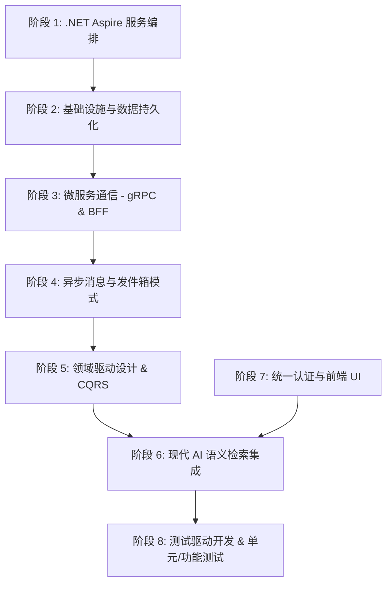

# eShop 技术栈学习指南与实战路径

本指南旨在帮助您由浅入深地系统性学习 [eShop](file:///D:/Repos/eShop) 仓库中使用的现代 .NET 微服务技术栈。该仓库是由 Microsoft 官方提供的、基于 **.NET 10.0** 和 **.NET Aspire 13.4.6** 构建的高水准云原生电商系统样例，几乎涵盖了企业级分布式开发和 AI 集成的全部核心理念。

---

## 学习路线图概览

学习本仓库的最佳路线可分为八个阶段，从核心的云原生编排开始，逐步深入到分布式架构设计和 AI 应用：

---

## 项目核心 NuGet 包详表与作用说明

项目在集中包管理配置文件 [Directory.Packages.props](file:///D:/Repos/eShop/Directory.Packages.props) 中对所有包版本进行了集中锁定。以下是微服务架构中核心包的功能剖析与学习建议：

### 1. 云原生编排与弹性组件 (.NET Aspire)
* **`Aspire.Hosting.*`** (例如 `PostgreSQL` / `Redis` / `RabbitMQ` / `Yarp`):
  * **作用说明**：供 AppHost 项目用于拉取 Docker 镜像容器，并在分布式节点中注册相应的微服务拓扑和资源关系。
  * **学习路径**：在 [eShop.AppHost](file:///D:/Repos/eShop/src/eShop.AppHost) 中查看组件注册，理解基础设施是如何被容器化管理的。
* **`Microsoft.Extensions.ServiceDiscovery`**:
  * **作用说明**：微服务自动发现机制。微服务之间不需要硬编码 IP 或端口号，而是直接通过服务标识符（如 `http://catalog-api/`）动态解析端点。
* **`Microsoft.Extensions.Http.Resilience`**:
  * **作用说明**：集成强大的 Polly 回弹性引擎。为微服务间的 HTTP 客户端自动绑定重试策略、熔断器、超时机制与隔板限制，大幅提升网络抖动时的系统韧性。

### 2. 身份认证与安全机制 (OIDC)
* **`Duende.IdentityServer`** 及相关包 (`AspNetIdentity` / `EntityFramework`):
  * **作用说明**：业界顶级的 OAuth 2.0 / OpenID Connect (OIDC) 单点登录 (SSO) 服务器，处理发牌、验签、用户凭证及客户端配置。
  * **学习路径**：阅读 [Identity.API](file:///D:/Repos/eShop/src/Identity.API) 源码，了解认证服务器的工作机制。
* **`Duende.IdentityModel.OidcClient`** & **`Duende.IdentityModel`**:
  * **作用说明**：客户端（例如 MAUI 或网页前端）专用的认证代理库。负责管理本地授权码流程（PKCE）的弹窗，安全获取、刷新并维护 Access Token。

### 3. 数据存取与持久化 (ORM)
* **`Npgsql.EntityFrameworkCore.PostgreSQL`**:
  * **作用说明**：PostgreSQL 官方的 Entity Framework Core 适配器，处理微服务写逻辑的面向对象数据映射（Ordering.API 写入与迁移）。
* **`Dapper`**:
  * **作用说明**：极轻量的高性能半自动 ORM (Micro-ORM)。在 Ordering.API 中用于“只读”（Query）操作，直接通过 SQL 裸写查询数据以换取极致的吞吐性能。

### 4. 高阶 AI 与向量数据库
* **`Microsoft.Extensions.AI`**:
  * **作用说明**：微软官方抽象的标准 AI 开发包。提供了大模型调用（Chat）和多维向量生成（Embedding）的通用编程接口，让代码不绑定具体大模型厂商。
* **`CommunityToolkit.Aspire.Hosting.Ollama`** / **`OllamaSharp`**:
  * **作用说明**：在 .NET Aspire 下本地编排 Ollama 容器，并使用 OllamaSharp 生成 384 维商品语义 Embedding 向量。
* **`Pgvector.EntityFrameworkCore`**:
  * **作用说明**：将 PostgreSQL 的 `pgvector` 向量扩展无缝融入 EF Core。使得我们可以在 C# LINQ 查询中直接使用 `CosineDistance` 等函数进行数据库级的相似度排序。

### 5. 分布式通讯与事件总线
* **`Grpc.AspNetCore`** & **`Grpc.Tools`**:
  * **作用说明**：基于 HTTP/2 的强契约、高性能同步二进制通信组件。在本项目中用于客户端直接高效存取购物车（`Basket.API`）。
* **`MediatR`**:
  * **作用说明**：进程内内存总线（In-Process Command/Event Bus）。用来彻底解耦 Web 控制器与底层业务 Handler，是 CQRS 架构模式的底层基石。
* **`FluentValidation`**:
  * **作用说明**：声明式参数校验引擎，利用链式语法在请求进入 CommandHandler 前拦截并抛出非法数据。

### 6. 可观测性 (OpenTelemetry)
* **`OpenTelemetry.Exporter.OpenTelemetryProtocol`** & 各种 Instrumentation:
  * **作用说明**：零侵入式自动收集并输出微服务在运行期间的 HTTP 耗时、Trace 调用链路、内存与 CPU 指标（Metrics）和日志。

---

## 八大阶段实战与学习方法路径

### 阶段 1: .NET Aspire 服务编排
.NET Aspire 极大地降低了微服务物理拓扑连接与环境配置的成本。
* **源码学习切入点**：
  * [eShop.AppHost/Program.cs](file:///D:/Repos/eShop/src/eShop.AppHost/Program.cs) —— 学习 Redis、RabbitMQ、PostgreSQL 容器的集中声明与互联。
  * [eShop.ServiceDefaults/Extensions.cs](file:///D:/Repos/eShop/src/eShop.ServiceDefaults/Extensions.cs) —— 学习可观测性与标准 HTTP 回弹性 Polly 策略的集中注入。
* **方法路径**：跑通 AppHost 后，打开 Aspire Dashboard。下单一件商品，在 Tracing 界面中清晰查看一个事务调用流如何从 `webapp` $\rightarrow$ `catalog-api` $\rightarrow$ `basket-api` $\rightarrow$ `ordering-api`。

### 阶段 2: 基础设施与数据持久化
理解微服务中的库表隔离以及分布式缓存的使用。
* **源码学习切入点**：
  * [Basket.API/Program.cs](file:///D:/Repos/eShop/src/Basket.API/Program.cs) —— 学习如何注册 Redis 的分布式组件。
  * [Catalog.API/Infrastructure/CatalogContext.cs](file:///D:/Repos/eShop/src/Catalog.API/Infrastructure/CatalogContext.cs) —— 学习商品多实体关系的 Fluent 映射。
* **方法路径**：研究项目如何运用不同的 `DbContext` 将 `catalogdb`、`orderingdb` 进行数据库物理隔离。

### 阶段 3: 微服务同步通信: BFF 网关与 gRPC
学习在不同场景下对 gRPC 二进制与 HTTP RESTful 通信方式进行技术权衡。
* **源码学习切入点**：
  * [basket.proto](file:///D:/Repos/eShop/src/ClientApp/Services/Basket/Protos/basket.proto) —— 学习 gRPC protobuf 契约。
  * [eShop.AppHost/Extensions.cs](file:///D:/Repos/eShop/src/eShop.AppHost/Extensions.cs#L185-L251) —— 研读网关 YARP 的转发与路由重定向设计。

### 阶段 4: 异步消息与最终一致性 (Outbox Pattern)
掌握跨服务场景下利用“发件箱模式”保证事件可靠投递的设计。
* **源码学习切入点**：
  * [IntegrationEventLogEF](file:///D:/Repos/eShop/src/IntegrationEventLogEF) —— 研读事务消息日志的存取状态转换机（Started/Published/Failed）。
  * [CatalogApi.cs](file:///D:/Repos/eShop/src/Catalog.API/Apis/CatalogApi.cs#L347-L361) —— 观察业务更新与日志写入如何被放在同一个本地 EF 事务中提交。
  * [RabbitMQEventBus.cs](file:///D:/Repos/eShop/src/EventBusRabbitMQ/RabbitMQEventBus.cs) —— 查看 RabbitMQ 底层连接、交换机声明及消费管道的可靠封装。

### 阶段 5: 领域驱动设计 (DDD) 与 CQRS
学习复杂业务场景下如何以领域模型为核心开展高内聚开发。
* **源码学习切入点**：
  * [Order.cs](file:///D:/Repos/eShop/src/Ordering.Domain/AggregatesModel/OrderAggregate/Order.cs) —— 学习非贫血富领域模型的设计，将业务逻辑收拢于实体方法内部。
  * [CreateOrderCommandHandler.cs](file:///D:/Repos/eShop/src/Ordering.API/Application/Commands) —— 学习 MediatR 介导下的写操作事务流程。
* **方法路径**：理清“写操作”经由领域聚合发出“领域事件（Domain Event）”，而“读操作”绕过领域层直连数据库（Dapper）的读写职责分离逻辑。

### 阶段 6: 现代 AI 语义向量检索
学习如何在 C# 生态中快速引入 AI 语义关联检索。
* **源码学习切入点**：
  * [CatalogAI.cs](file:///D:/Repos/eShop/src/Catalog.API/Services/CatalogAI.cs) —— 研读 `IEmbeddingGenerator` 接口如何将商品描述字符串输出为 `384` 维浮点向量。
  * [CatalogApi.cs](file:///D:/Repos/eShop/src/Catalog.API/Apis/CatalogApi.cs#L258-L288) —— 学习如何在 LINQ 查询中使用 `CosineDistance(vector)` 进行数据库端的余弦距离排序。
* **方法路径**：本地下载并启动 Ollama，在 AppHost 中配置 `bool useOllama = true` 跑通本地向量模型。

### 阶段 7: 统一认证与前端 UI
理解令牌（Token）透传机制及跨平台 UI 架构。
* **源码学习切入点**：
  * [Program.cs](file:///D:/Repos/eShop/src/Identity.API/Program.cs) —— IdentityServer 与用户 ASP.NET Core Identity 的配置契合。
  * [Extensions.cs](file:///D:/Repos/eShop/src/WebApp/Extensions/Extensions.cs#L53-L92) —— 学习如何在发起 HTTP 外部请求时，通过 DelegatingHandler 自动提取并透传 JwtBearer Token。
  * [MauiProgram.cs](file:///D:/Repos/eShop/src/ClientApp/MauiProgram.cs) —— 学习 MAUI Blazor Hybrid 跨移动端/桌面端的一套代码跨平台渲染架构。

### 阶段 8: 测试驱动开发 (TDD) 与容器化集成测试
这是整个系统高质量交付的保障核心。
* **源码学习切入点**：
  * [CatalogApiFixture.cs](file:///D:/Repos/eShop/tests/Catalog.FunctionalTests/CatalogApiFixture.cs) —— 学习集成测试如何通过 Aspire 直接拉起隔离的真 Postgres 容器，动态获取连接并传入 `WebApplicationFactory`。
  * 学习在 `ClientApp.UnitTests` 中如何应用 `Assert.IsNotEmpty` 和 `Assert.IsEmpty` 开展强类型测试校验。
